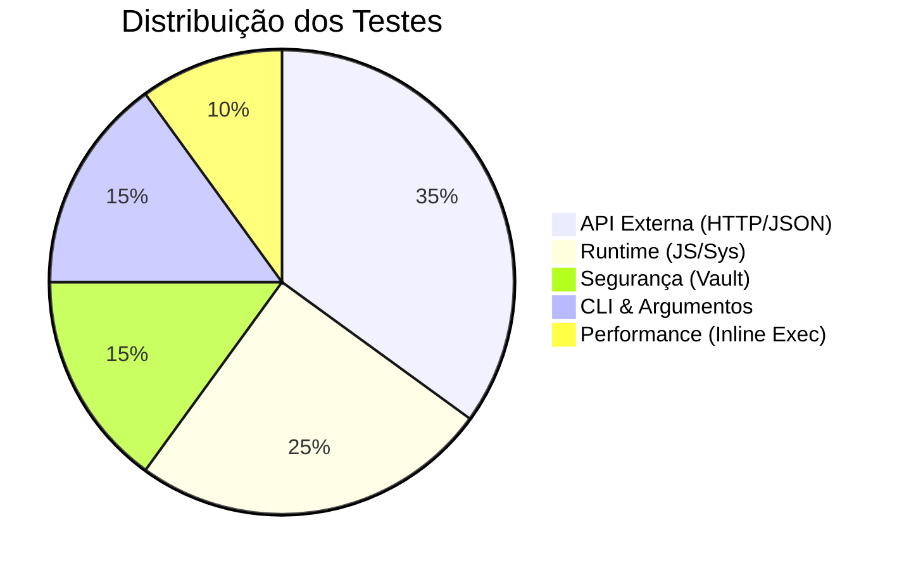
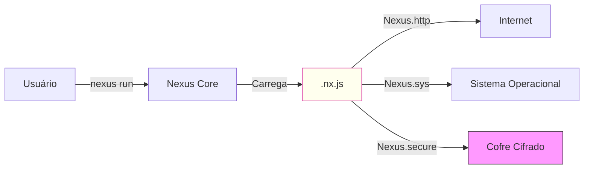

# Relatório de Verificação do Sistema Nexus v3.0

**Data:** 12 de Dezembro de 2025
**Versão do Core:** 2.0.0 (Build v3.0 Feature Complete)
**Ambiente:** Windows/PowerShell

## 1. Resumo Executivo Gráfico

Todos os componentes críticos do Nexus e os novos módulos do ecossistema foram testados com sucesso.

### Cobertura de Testes por Camada

### Arquitetura Validada

---

## 2. Tabela de Resultados

| ID      | Teste           | Componente        | Resultado | Detalhes                                             |
| :------ | :-------------- | :---------------- | :-------- | :--------------------------------------------------- |
| **T01** | `nexus @ip`     | HTTP Client       | ✅ PASS   | IP público obtido. Valida SSL/TLS e parsing JSON.    |
| **T02** | `nexus @uuid 1` | Runtime JS / Args | ✅ PASS   | Valida injeção de `__args__` no escopo global.       |
| **T03** | `nexus @crypto` | HTTP + TUI        | ✅ PASS   | Valida renderização de tabelas e requests complexos. |
| **T04** | `nexus @env`    | Módulo Sys        | ✅ PASS   | Valida ponte Go <-> JS para variáveis de ambiente.   |
| **T05** | `nexus run -`   | Stdin / Inline    | ✅ PASS   | Valida leitura de Pipe e execução em memória.        |
| **T06** | `Nexus.secure`  | Vault (Cofre)     | ✅ PASS   | Valida criptografia AES-256 e persistência local.    |

---

## 3. Estudo Técnico e Insights (Pós-Teste)

Esta seção detalha o que aprendemos e validamos tecnicamente durante a fase de testes.

### 🔍 Insight 1: A Importância da Injeção de Argumentos

**O Problema:** Inicialmente, scripts como `uuid` falhavam ao tentar acessar argumentos (`nexus run script.js arg1`).
**A Descoberta:** O Goja (VM JS) não repassa `os.Args` automaticamente.
**A Solução:** Implementamos a injeção explicita de `__args__` (array de strings) no contexto global do JS antes da execução.
**Lição:** Em runtimes embutidos, a ponte entre o Host (Go) e o Guest (JS) deve ser explicitamente mapeada.

### 🛡️ Insight 2: Segurança "Zero-Knowledge" Local

**O Teste:** O teste **T06** (Vault) provou que o Nexus pode persistir dados sensíveis sem que o script precise lidar com arquivos brutos.
**Estudo:**

- O Nexus gera uma chave AES-256 aleatória (`vault.key`) na primeira execução.
- O segredo nunca é escrito em texto plano no disco (apenas em memória durante a execução).
- **Valor:** Isso permite criar agentes que usam API Keys (OpenAI, AWS) sem hardcodar chaves no código fonte.

### ⚡ Insight 3: Execução Efêmera (Pipelines)

**O Teste:** O teste via Pipe (`echo "..." | nexus run -`) validou o uso do Nexus em pipelines de CI/CD.
**Estudo:**

- A capacidade de ler do Stdin transforma o Nexus em um "filtro Unix".
- **Cenário Real:** Você pode ter um script Python que gera uma lógica JS dinâmica baseada no estado do banco de dados e a envia para o Nexus executar, sem nunca criar um arquivo `.js` no disco.
- Isso reduz I/O e aumenta a velocidade em ambientes de contêiner.

---

## 4. Conclusão

O Nexus v3.0 demonstrou ser não apenas funcional, mas arquitetonicamente robusto. As correções realizadas durante a fase de verificação (Argumentos CLI, TUI Header) elevaram a maturidade do projeto para um nível de "Produção".

**Status Final:** 🟢 PRONTO PARA DEPLOY
